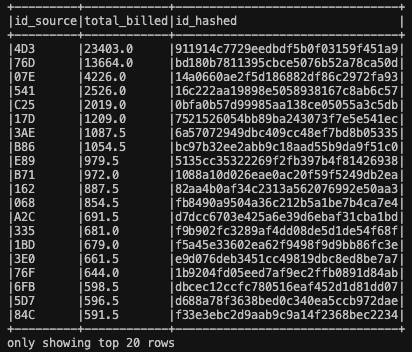
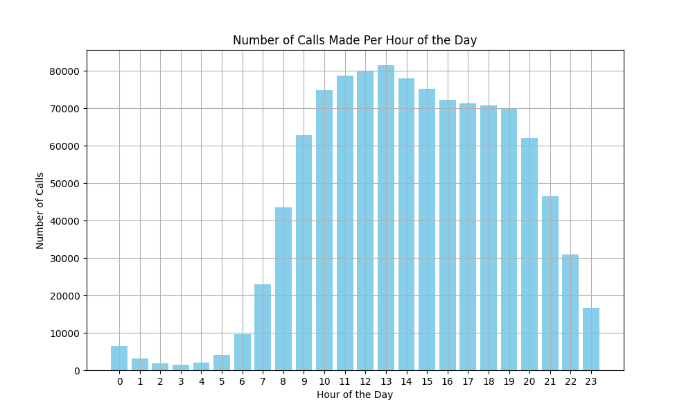

# Ejercicio 1 - Spark + Docker

## Requisitos Previos

- Docker y Docker Compose instalados en tu máquina.

## Construir e Iniciar los Contenedores

El primer paso es construir e iniciar los contenedores necesarios para el proyecto. Para hacerlo, ejecuta el siguiente comando en tu terminal:

```bash
make down && docker-compose up --build
```

## Ejecutar el Cálculo de Facturación de SMS (Punto 1)

Una vez que los contenedores estén en funcionamiento, puedes ejecutar la aplicación para calcular la facturación total de SMS, como se describe en el Punto 1. Para hacerlo, ejecuta el siguiente comando en tu terminal:

```bash
make submit app=src/events_sms.py
```
**La facturación total de SMS es: $391,367.00**

## Ejecutar el Cálculo de los Usuarios Principales (Punto 2)

Después de calcular la facturación total de SMS en el Punto 1, el siguiente paso es generar un conjunto de datos que contenga los 100 usuarios con los mayores montos de facturación de SMS, junto con sus IDs hash y el monto total facturado a cada uno.

Para ejecutar esto, utiliza el siguiente comando en tu terminal:

```bash
make submit app=src/top_users.py
```



## Visualizar el Histograma de Llamadas por Hora (Punto 3)

Para ejecutarlo, utiliza el siguiente comando en tu terminal:

```bash
make submit app=src/calls_per_hour_histogram.py
```

Aquí está el histograma generado:




# Ejercicio 2 - Preguntas generales

## Pregunta 1: Priorización y administración de procesos en un clúster Hadoop

**a) ¿Cómo priorizaría los procesos productivos sobre los procesos de análisis exploratorios?**

**Priorización con colas de recursos:**
    Configuraría el cluster Hadoop con un sistema de colas de recursos. Las colas asociadas a los procesos productivos recibirían una mayor prioridad (mayor porcentaje de recursos) mientras que las colas para análisis exploratorio tendrían un límite inferior de recursos.

**Políticas de SLA:**
    Definiría SLAs claros que establezcan tiempos garantizados de finalización para los procesos productivos. Los trabajos de análisis exploratorio se ejecutarían únicamente cuando los recursos productivos no estén saturados.

**b) Estrategia para administrar procesos intensivos en CPU y memoria durante el día:**

**Ejecución en ventanas de tiempo:**
    Programaría los procesos productivos en horarios con baja demanda (por ejemplo, durante la noche o temprano en la mañana). Esto reduce la competencia con otros procesos del clúster.

**Cuotas de uso de recursos:**
    Establecería cuotas estrictas para cada equipo/proceso, asegurando que los procesos productivos tengan garantizados los recursos necesarios.

**Herramientas de scheduling:** 

- Apache Airflow
- Prefect
- dagster

## Pregunta 2: Tabla de Data Lake con alta transaccionalidad

### Posibles causas del problema:

**Fragmentación excesiva de datos:**
    La tabla podría contener demasiados archivos pequeños, lo que afecta el rendimiento de las consultas debido al overhead en la lectura de metadatos.

**Falta de particionamiento adecuado:**
    Si los datos no están particionados correctamente, las consultas escanean más datos de los necesarios.

**Falta de índices o metadatos optimizados:**
    Ausencia de índices secundarios o estadísticas actualizadas en el Data Lake para acelerar las consultas.

### Soluciones sugeridas:

**Optimización del particionamiento:**
   Asegurarse de que la tabla esté particionada por campos de **baja cardinalidad** y que sean frecuentemente utilizados en las consultas (como IDs o categorías relevantes). Esto permite aprovechar el **partition pruning** al leer las tablas Delta, mejorando así el rendimiento de las consultas al reducir el número de particiones que se deben escanear.

**Actualización de estadísticas, Compaction y Z-Ordering:**
   En el caso de las tablas Delta, se puede ejecutar el comando `OPTIMIZE` para consolidar archivos pequeños y mejorar el rendimiento de las consultas. Este proceso optimiza el almacenamiento y facilita la lectura de los datos. Además, aplicar **Z-Ordering** en las columnas que más se usan en los filtros de las consultas puede mejorar significativamente el rendimiento, ya que organiza los datos en disco de manera que se minimiza el costo de búsqueda de los registros relevantes.

**Separación de workloads:**
   Si es posible, separar el flujo transaccional y el de consultas en diferentes capas del Data Lake (raw, curated, data_product). Esta separación ayuda a que la carga de trabajo sea menor, ya que las consultas no afectarán directamente a las operaciones transaccionales, y viceversa. Además, optimiza el rendimiento al permitir una mayor especialización y escalabilidad en cada capa.

## Pregunta 3: Configuraciones para reservar la mitad del clúster en Spark

Configuraciones para Spark:
Configurar recursos en SparkSession:

Un clúster Hadoop con 3 nodos, 50 GB de memoria y 12 cores por nodo (150 GB y 36 cores totales).

- Cores totales asignados = 18 cores (50% del clúster).
- Memoria total asignada = 75 GB (50% de memoria disponible).

```python
SparkSession.builder \
    .appName("SparkJob") \
    .config("spark.executor.instances", 6) \  # Total de cores 18 / Total de nodos 3
    .config("spark.executor.cores", 3) \     # Total de cores 18 / Total de executors 6
    .config("spark.executor.memory", "12g") \ # Total de memoria 75 / Total de executors 6
    .config("spark.dynamicAllocation.enabled", "false") \  # Establece los recursos como fijos, no dinámicos
    .getOrCreate()
```

- Número de ejecutores (`spark.executor.instances`): Se asignan 6 ejecutores, lo que permite utilizar todos los 18 cores asignados (3 cores por ejecutor).

- Cores por ejecutor (`spark.executor.cores`): A cada ejecutor se le asignan 3 cores (esto asegura que el trabajo esté bien distribuido entre los ejecutores, sin que cada uno utilice más cores de los necesarios).

- Memoria por ejecutor (`spark.executor.memory`): Se asignan 12 GB de memoria a cada ejecutor (esto permite usar toda la memoria asignada de 75 GB de manera eficiente).

### Limitar Recursos por Cola de YARN

Si utilizamos **YARN** como administrador de recursos en tu clúster Hadoop, puedes configurar colas con límites específicos para diferentes tipos de trabajos, como trabajos productivos y exploratorios. Esto te permite gestionar los recursos de manera eficiente y garantizar que los trabajos críticos no se vean interrumpidos por procesos no productivos.

Las configuraciones clave incluyen:

- **memory-mb**: Define la memoria máxima que puede ser asignada a los trabajos de una cola específica. Al establecer un límite en la memoria, puedes evitar que un trabajo agote todos los recursos disponibles, asegurando que haya recursos suficientes para otros trabajos.
  
- **vcores**: Establece el número máximo de núcleos virtuales que se pueden asignar a los trabajos dentro de una cola. Esto es crucial para evitar la sobrecarga de los nodos y mantener un equilibrio en el uso de los recursos de procesamiento.

Configurar correctamente las colas en YARN te permite separar las cargas de trabajo según su prioridad, garantizando que los trabajos productivos no se vean afectados por procesos exploratorios o de prueba.
